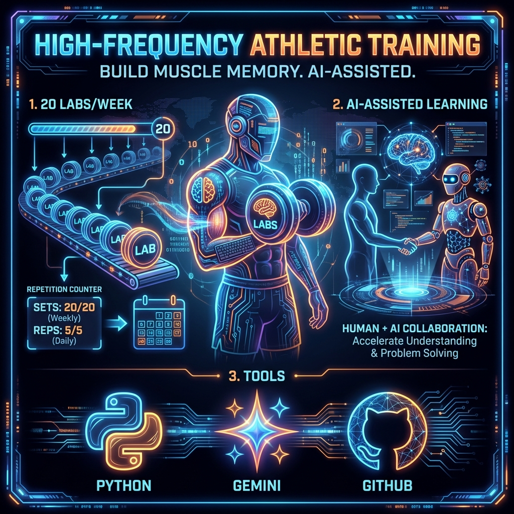

# 🐍 Intelligent Data Analysis & Cloud Applications (Spring 2026)


[](https://www.python.org/)
[](https://colab.research.google.com/)
[](#emi-support-strategy)
[]()

> **"You are the Pilot, AI is the Co-pilot."**  
> Welcome to the repository for the **Data Analysis 2026** course at CHU. This course is designed to transform you from a coding novice to a data athlete through **High-Frequency Athletic Training**.

---

## 🏫 Course Philosophy: Athletic Training 🏋️‍♂️

We believe that coding is a physical skill that requires muscle memory.
*   **20 Labs/Week**: Just like doing reps in the gym.
*   **Visual Feedback**: We start with Turtle Graphics because if you can *see* your logic errors, you can fix them.
*   **AI-Assisted**: Learn to prompt, refactor, and architect with LLMs (Gemini/ChatGPT).



---

## 📅 Course Roadmap

### Phase 1: Visual Python (The Foundation)

### Phase 2: Data Processing (The Core)

### Phase 3: Visualization & Applications

---

## 🚀 Getting Started

1.  **Open in Colab**: Most labs are designed to run in Google Colab.
2.  **Install Dependencies**:
    ```python
    !pip install ColabTurtlePlus pandas seaborn yfinance
    ```

---

## 🌏 EMI Support Strategy (Bilingual Bridge)

This course uses the **"Keyword Sandwich"** method for non-native English speakers:
*   **English**: All Code, Technical Terms, Error Messages.
*   **Chinese**: Context, "Why", and Deep Logic explanations.

---

*"Talk is cheap. Show me the code." - Linus Torvalds*

